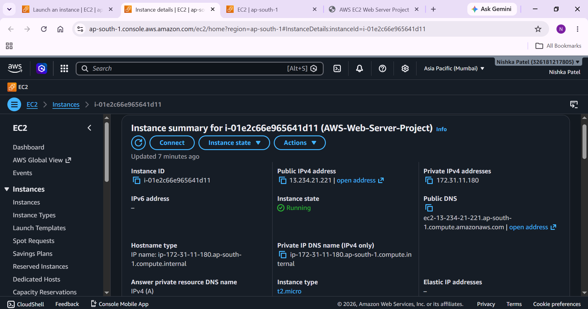
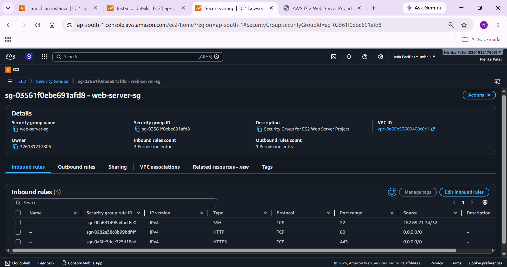
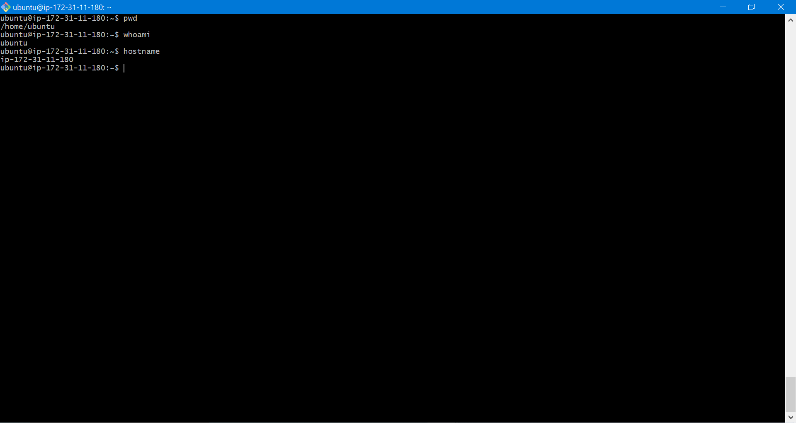
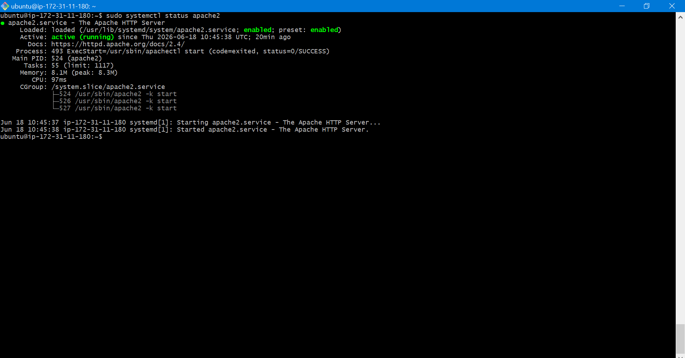
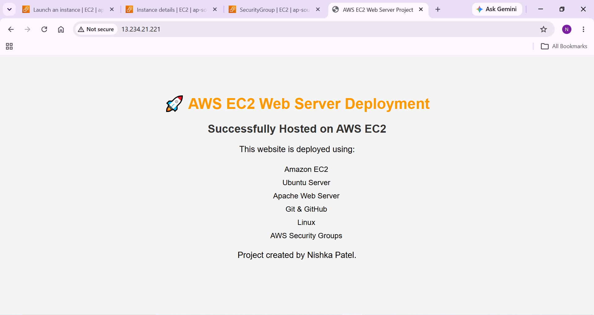
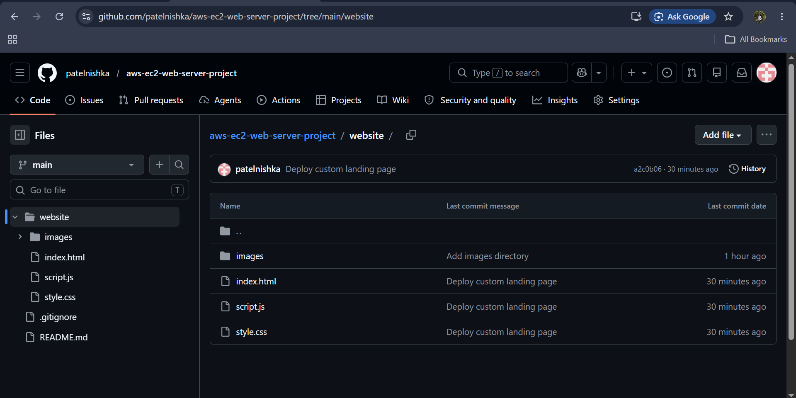

# 🚀 Secure & Scalable Web Server Deployment on AWS EC2

A beginner-friendly cloud project demonstrating how to deploy a static website on an AWS EC2 Ubuntu instance using Apache Web Server. This project covers AWS infrastructure setup, Linux server administration, networking, Git, and GitHub.

---

## 📌 Project Overview

This project demonstrates the complete deployment lifecycle of a web server on AWS.

The website is hosted on an Amazon EC2 Ubuntu instance, secured using AWS Security Groups, and served through the Apache Web Server.

---

## 🛠️ Technologies Used

- Amazon Web Services (AWS)
- Amazon EC2
- Ubuntu Server
- Apache2 Web Server
- Linux
- SSH
- AWS Security Groups
- Git
- GitHub
- HTML
- CSS
- JavaScript

---

## 🏗️ Project Architecture

```
                Internet
                    │
                    ▼
         AWS Security Group
         (Ports 22, 80, 443)
                    │
                    ▼
           EC2 Ubuntu Instance
                    │
                    ▼
           Apache Web Server
                    │
                    ▼
          Static Website Files
```

---

## 📂 Project Structure

```
aws-ec2-web-server-project/
│
├── README.md
├── .gitignore
├── architecture/
├── commands/
│   └── commands.md
├── screenshots/
├── website/
│   ├── index.html
│   ├── style.css
│   ├── script.js
│   └── images/
```

---

## 🚀 Features

- Launch AWS EC2 Ubuntu Instance
- Configure AWS Security Groups
- Connect using SSH
- Install Apache Web Server
- Deploy Static Website
- Configure Custom Landing Page
- Automatic Apache Startup
- Git Version Control
- GitHub Repository

---

## ⚙️ Deployment Steps

1. Launch EC2 Ubuntu Instance
2. Configure Security Groups
3. Connect using SSH
4. Update Ubuntu Packages
5. Install Apache2
6. Start and Enable Apache Service
7. Upload Website Files
8. Deploy Website
9. Verify Website in Browser
10. Document the Project

---

## 📸 Project Screenshots

### EC2 Instance



---

### Security Group



---

### SSH Connection



---

### Apache Running



---

### Website



---

### GitHub Repository



---

## 📚 Skills Demonstrated

- AWS EC2
- Linux Administration
- Apache Web Server
- Networking
- SSH
- Security Groups
- Website Deployment
- Git
- GitHub
- Basic Cloud Architecture

---

## 🔮 Future Improvements

- Configure HTTPS using Let's Encrypt
- Register and use a custom domain
- Deploy a dynamic web application
- Configure Nginx Reverse Proxy
- Automate deployment using CI/CD
- Use Infrastructure as Code (Terraform)

---

## 👩‍💻 Author

**Nishka Patel**

GitHub: https://github.com/patelnishka

Project Repository:

https://github.com/patelnishka/aws-ec2-web-server-project

---

## ⭐ Acknowledgement

This project was built as part of my Cloud & DevOps learning journey to gain hands-on experience with AWS, Linux, Apache, Git, and GitHub.